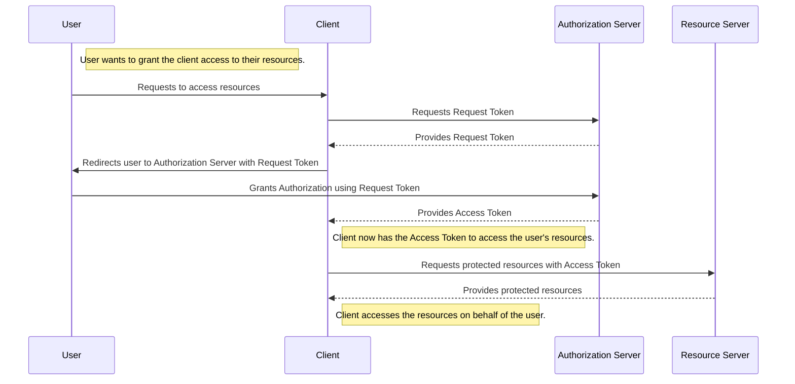
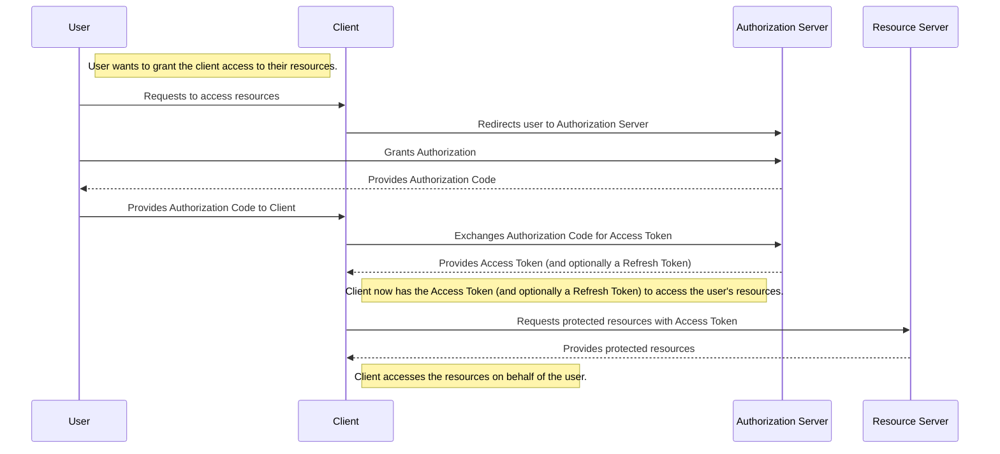
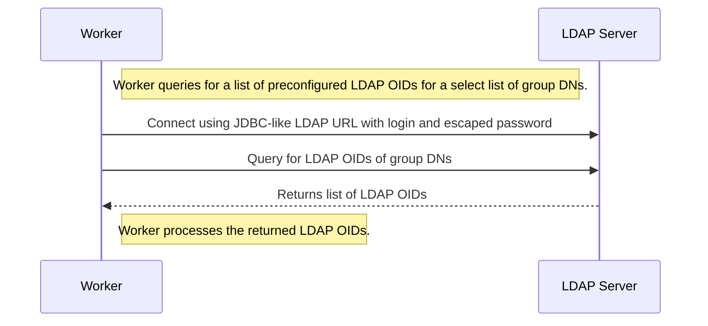
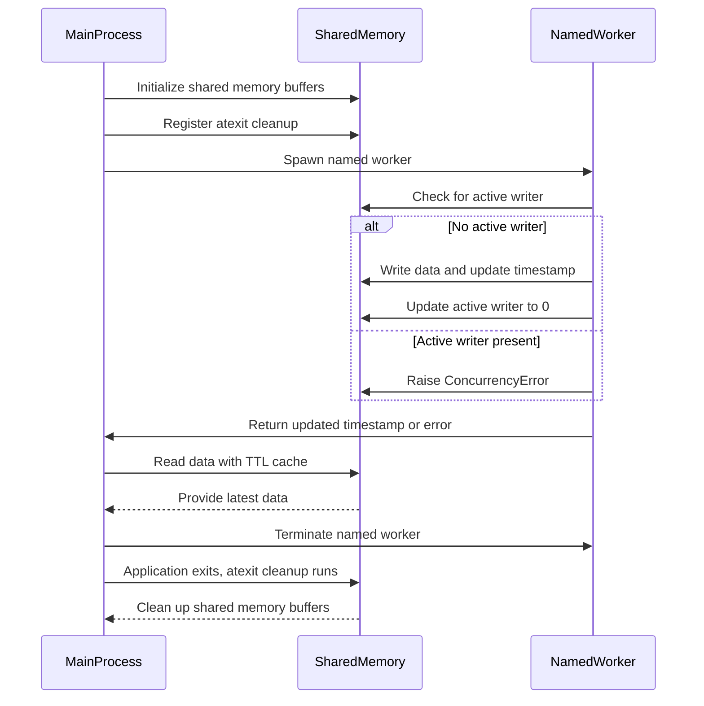

### oauh2



### oauh2



### ldap worker



```python
import ldap3

class LdapWorker:
    @staticmethod
    def query_ldap_oids(ldap_url, bind_dn, password, group_dns):
        # Create a connection to the LDAP server
        server = ldap3.Server(ldap_url, get_info=ldap3.ALL)
        connection = ldap3.Connection(server, user=bind_dn, password=password, auto_bind=True)

        def get_group_members(group_dn):
            # Search for members of the group
            connection.search(
                search_base=group_dn,
                search_filter='(objectClass=*)',
                search_scope=ldap3.BASE,
                attributes=['member', 'objectIdentifier']
            )
            members = []
            for entry in connection.entries:
                if 'member' in entry:
                    members.extend(entry.member.values)
                if 'objectIdentifier' in entry:
                    oids.extend(entry.objectIdentifier.values)
            return members

        def expand_group_members(members, visited):
            for member in members:
                if member in visited:
                    continue
                visited.add(member)
                connection.search(
                    search_base=member,
                    search_filter='(objectClass=*)',
                    search_scope=ldap3.BASE,
                    attributes=['objectClass', 'member', 'objectIdentifier']
                )
                for entry in connection.entries:
                    object_classes = entry.objectClass.values
                    if 'user' in object_classes or 'service' in object_classes:
                        if 'objectIdentifier' in entry:
                            oids.extend(entry.objectIdentifier.values)
                    elif 'group' in object_classes:
                        new_members = entry.member.values if 'member' in entry else []
                        expand_group_members(new_members, visited)

        oids = []
        visited = set()
        for group_dn in group_dns:
            members = get_group_members(group_dn)
            expand_group_members(members, visited)

        connection.unbind()
        return oids

# Example usage:
ldap_url = 'ldap://example.com:389'
bind_dn = 'cn=admin,dc=example,dc=com'
password = 'password'
group_dns = ['cn=group1,dc=example,dc=com', 'cn=group2,dc=example,dc=com']

worker = LdapWorker()
oids = worker.query_ldap_oids(ldap_url, bind_dn, password, group_dns)
print(oids)

```

### inmemory swap-two (write-copy, read-copy, subprocess-safe, single writer many readers, nonlocking) named storage using shmem and json to gzip to shmem serialization and attrs

```pythonimport json
import gzip
import multiprocessing as mp
import multiprocessing.shared_memory as shmem
import time
import atexit
from typing import TypeVar, Generic, Protocol, Dict, Any, Type
import attrs
import os

T = TypeVar('T', bound='AttrsSerializable')

class AttrsSerializable(Protocol):
    def as_dict(self) -> Dict[str, Any]:
        ...

    @classmethod
    def from_dict(cls: Type[T], data: Dict[str, Any]) -> T:
        ...

@attrs.define
class ExampleData(AttrsSerializable):
    key: str
    value: str

    def as_dict(self) -> Dict[str, Any]:
        return attrs.asdict(self)

    @classmethod
    def from_dict(cls: Type['ExampleData'], data: Dict[str, Any]) -> 'ExampleData':
        return cls(**data)

class ConcurrencyError(Exception):
    pass

@attrs.define
class AbstractStorage(Generic[T]):
    _name: str
    _buffer_size: int = attrs.field(default=1024 * 1024)
    _shm_buffers: list = attrs.field(init=False)
    _active_buffer_index: mp.Value = attrs.field(init=False)
    _updated_ts: mp.Value = attrs.field(init=False)
    _lock: mp.Lock = attrs.field(init=False)
    _active_writer: mp.Value = attrs.field(init=False)

    def __attrs_post_init__(self):
        self._shm_buffers = [
            shmem.SharedMemory(name=f'{self._name}_0', create=True, size=self._buffer_size),
            shmem.SharedMemory(name=f'{self._name}_1', create=True, size=self._buffer_size)
        ]
        self._active_buffer_index = mp.Value('i', 0)
        self._updated_ts = mp.Value('d', time.time())
        self._lock = mp.Lock()
        self._active_writer = mp.Value('i', 0)  # 0 means no active writer

    def write(self, data: T):
        current_pid = mp.current_process().pid
        with self._lock:
            if self._active_writer.value != 0 and self._active_writer.value != current_pid:
                raise ConcurrencyError(f"Process {self._active_writer.value} is already writing.")

            self._active_writer.value = current_pid
        
        try:
            serialized_data = json.dumps(data.as_dict()).encode('utf-8')
            compressed_data = gzip.compress(serialized_data)
            if len(compressed_data) > self._buffer_size:
                raise ValueError("Data size exceeds shared memory buffer size")

            inactive_index = (self._active_buffer_index.value + 1) % 2
            self._shm_buffers[inactive_index].buf[:len(compressed_data)] = compressed_data

            # Atomically update the active buffer index and timestamp
            with self._lock:
                self._active_buffer_index.value = inactive_index
                self._updated_ts.value = time.time()
        finally:
            with self._lock:
                self._active_writer.value = 0

    def read(self) -> T:
        with self._lock:
            active_index = self._active_buffer_index.value
        compressed_data = bytes(self._shm_buffers[active_index].buf).rstrip(b'\x00')
        serialized_data = gzip.decompress(compressed_data).decode('utf-8')
        data_dict = json.loads(serialized_data)
        return self.__orig_class__.__args__[0].from_dict(data_dict)

    def get_updated_ts(self) -> float:
        return self._updated_ts.value

    def close(self):
        for shm in self._shm_buffers:
            shm.close()
            shm.unlink()

# Ensure the shared memory is cleaned up on application exit
def cleanup_instance():
    global Instance
    if Instance is not None:
        Instance.close()
        Instance = None

atexit.register(cleanup_instance)

# Singleton instance for shared data
Instance: AbstractStorage[ExampleData] = AbstractStorage[ExampleData]("example_storage")


# Example usage with multiprocessing pool
def worker_task(data: ExampleData):
    global Instance
    try:
        Instance.write(data)
        return Instance.get_updated_ts()
    except ConcurrencyError as e:
        print(f"ConcurrencyError: {e}")

if __name__ == '__main__':
    example_data = ExampleData(key="test", value="This is a test")

    with mp.Pool(processes=4, initializer=None, initargs=()) as pool:
        named_workers = [mp.Process(target=worker_task, name=f'named_worker_{i}', args=(example_data,)) for i in range(4)]
        for worker in named_workers:
            worker.start()
        for worker in named_workers:
            worker.join()
 

    def read_from_storage():
        return Instance.read() 
    print(retrieved_data)

    print(f'Last updated timestamp: {Instance.get_updated_ts()}')


```


