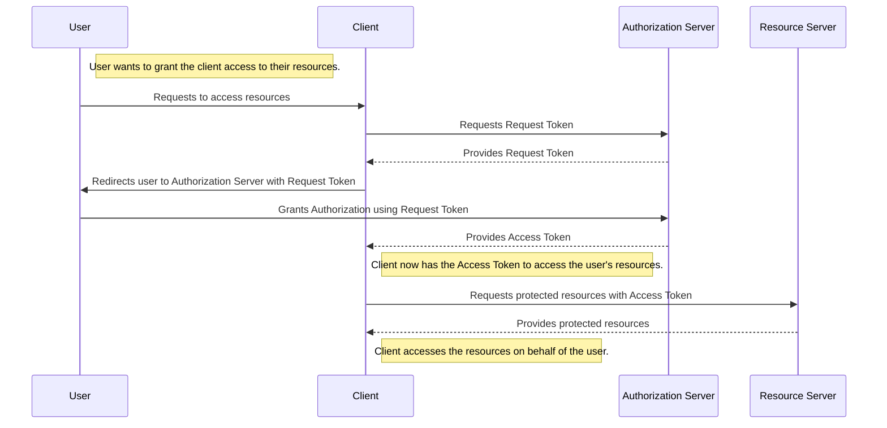

### oauh2



```mermaid

### oauh2

```sequenceDiagram
    participant User
    participant Client
    participant AS as Authorization Server
    participant RS as Resource Server

    Note right of User: User wants to grant the client access to their resources.

    User ->> Client: Requests to access resources
    Client ->> AS: Redirects user to Authorization Server
    User ->> AS: Grants Authorization
    AS -->> User: Provides Authorization Code
    User ->> Client: Provides Authorization Code to Client
    Client ->> AS: Exchanges Authorization Code for Access Token
    AS -->> Client: Provides Access Token (and optionally a Refresh Token)

    Note right of Client: Client now has the Access Token (and optionally a Refresh Token) to access the user's resources.

    Client ->> RS: Requests protected resources with Access Token
    RS -->> Client: Provides protected resources

    Note right of Client: Client accesses the resources on behalf of the user.
```
