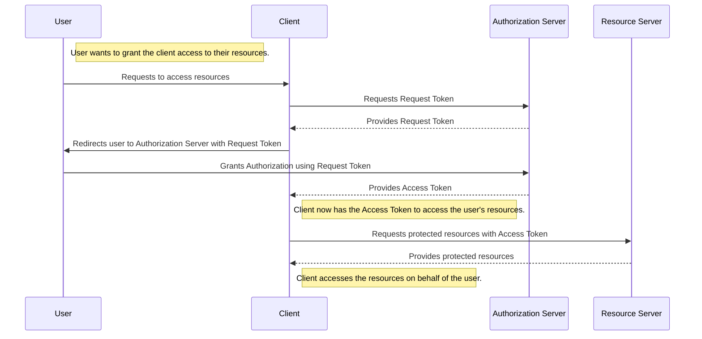
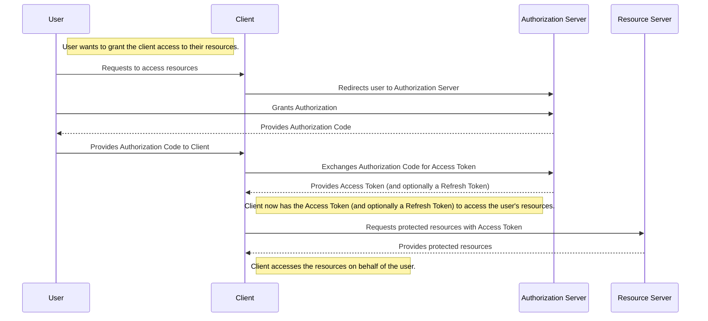
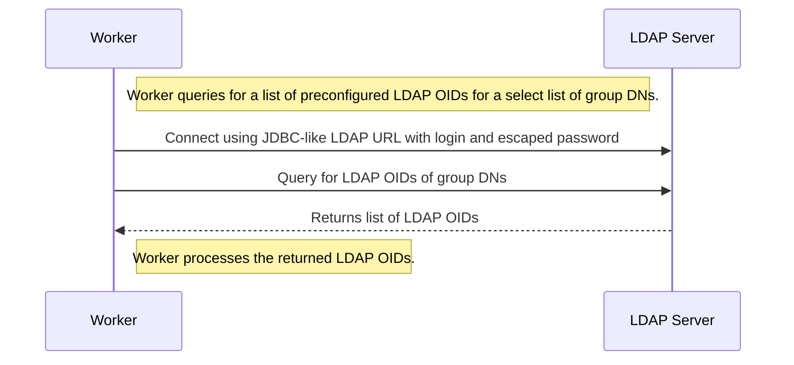
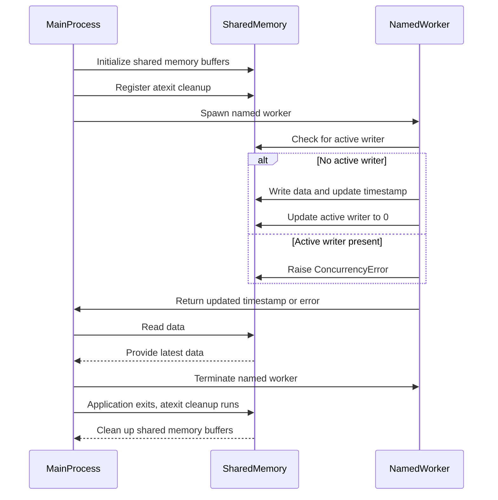
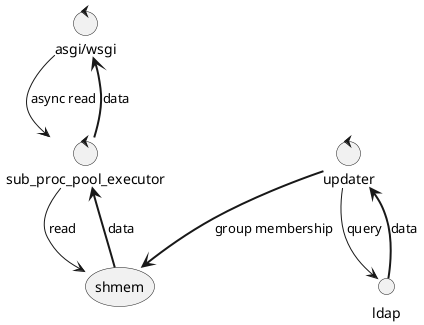

### oauh2



### oauh2



### ldap worker



```python
import ldap3

class LdapWorker:
    @staticmethod
    def query_ldap_oids(ldap_url, bind_dn, password, group_dns):
        # Create a connection to the LDAP server
        server = ldap3.Server(ldap_url, get_info=ldap3.ALL)
        connection = ldap3.Connection(server, user=bind_dn, password=password, auto_bind=True)

        def get_group_members(group_dn):
            # Search for members of the group
            connection.search(
                search_base=group_dn,
                search_filter='(objectClass=*)',
                search_scope=ldap3.BASE,
                attributes=['member', 'objectIdentifier']
            )
            members = []
            for entry in connection.entries:
                if 'member' in entry:
                    members.extend(entry.member.values)
                if 'objectIdentifier' in entry:
                    oids.extend(entry.objectIdentifier.values)
            return members

        def expand_group_members(members, visited):
            for member in members:
                if member in visited:
                    continue
                visited.add(member)
                connection.search(
                    search_base=member,
                    search_filter='(objectClass=*)',
                    search_scope=ldap3.BASE,
                    attributes=['objectClass', 'member', 'objectIdentifier']
                )
                for entry in connection.entries:
                    object_classes = entry.objectClass.values
                    if 'user' in object_classes or 'service' in object_classes:
                        if 'objectIdentifier' in entry:
                            oids.extend(entry.objectIdentifier.values)
                    elif 'group' in object_classes:
                        new_members = entry.member.values if 'member' in entry else []
                        expand_group_members(new_members, visited)

        oids = []
        visited = set()
        for group_dn in group_dns:
            members = get_group_members(group_dn)
            expand_group_members(members, visited)

        connection.unbind()
        return oids

# Example usage:
ldap_url = 'ldap://example.com:389'
bind_dn = 'cn=admin,dc=example,dc=com'
password = 'password'
group_dns = ['cn=group1,dc=example,dc=com', 'cn=group2,dc=example,dc=com']

worker = LdapWorker()
oids = worker.query_ldap_oids(ldap_url, bind_dn, password, group_dns)
print(oids)

```

### inmemory swap-two (write-copy, read-copy, subprocess-safe, single writer many readers, nonlocking) named storage using shmem and json to gzip to shmem serialization and attrs

```python
import json
import gzip
import multiprocessing as mp
import multiprocessing.shared_memory as shmem
import time
import atexit
from typing import TypeVar, Generic, Protocol, Dict, Any, Type
import attrs
import os

T = TypeVar('T', bound='AttrsSerializable')

class AttrsSerializable(Protocol):
    def as_dict(self) -> Dict[str, Any]:
        ...

    @classmethod
    def from_dict(cls: Type[T], data: Dict[str, Any]) -> T:
        ...

@attrs.define
class ExampleData(AttrsSerializable):
    key: str
    value: str

    def as_dict(self) -> Dict[str, Any]:
        return attrs.asdict(self)

    @classmethod
    def from_dict(cls: Type['ExampleData'], data: Dict[str, Any]) -> 'ExampleData':
        return cls(**data)

class ConcurrencyError(Exception):
    pass

@attrs.define
class AbstractStorage(Generic[T]):
    _name: str
    _buffer_size: int = attrs.field(default=1024 * 1024)
    _shm_buffers: list = attrs.field(init=False)
    _active_buffer_index: mp.Value = attrs.field(init=False)
    _updated_ts: mp.Value = attrs.field(init=False)
    _lock: mp.Lock = attrs.field(init=False)
    _active_writer: mp.Value = attrs.field(init=False)

    def __attrs_post_init__(self):
        self._shm_buffers = [
            shmem.SharedMemory(name=f'{self._name}_0', create=True, size=self._buffer_size),
            shmem.SharedMemory(name=f'{self._name}_1', create=True, size=self._buffer_size)
        ]
        self._active_buffer_index = mp.Value('i', 0)
        self._updated_ts = mp.Value('d', time.time())
        self._lock = mp.Lock()
        self._active_writer = mp.Value('i', 0)  # 0 means no active writer

    def write(self, data: T):
        current_pid = mp.current_process().pid
        with self._lock:
            if self._active_writer.value != 0 and self._active_writer.value != current_pid:
                raise ConcurrencyError(f"Process {self._active_writer.value} is already writing.")

            self._active_writer.value = current_pid
        
        try:
            serialized_data = json.dumps(data.as_dict()).encode('utf-8')
            compressed_data = gzip.compress(serialized_data)
            if len(compressed_data) > self._buffer_size:
                raise ValueError("Data size exceeds shared memory buffer size")

            inactive_index = (self._active_buffer_index.value + 1) % 2
            self._shm_buffers[inactive_index].buf[:len(compressed_data)] = compressed_data

            # Atomically update the active buffer index and timestamp
            with self._lock:
                self._active_buffer_index.value = inactive_index
                self._updated_ts.value = time.time()
        finally:
            with self._lock:
                self._active_writer.value = 0

    def read(self) -> T:
        with self._lock:
            active_index = self._active_buffer_index.value
        compressed_data = bytes(self._shm_buffers[active_index].buf).rstrip(b'\x00')
        serialized_data = gzip.decompress(compressed_data).decode('utf-8')
        data_dict = json.loads(serialized_data)
        return self.__orig_class__.__args__[0].from_dict(data_dict)

    def get_updated_ts(self) -> float:
        return self._updated_ts.value

    def close(self):
        for shm in self._shm_buffers:
            shm.close()
            shm.unlink()

# Ensure the shared memory is cleaned up on application exit
def cleanup_instance():
    global Instance
    if Instance is not None:
        Instance.close()
        Instance = None

atexit.register(cleanup_instance)

# Singleton instance for shared data
Instance: AbstractStorage[ExampleData] = AbstractStorage[ExampleData]("example_storage")


# Example usage with multiprocessing pool
def worker_task(data: ExampleData):
    global Instance
    try:
        Instance.write(data)
        return Instance.get_updated_ts()
    except ConcurrencyError as e:
        print(f"ConcurrencyError: {e}")

if __name__ == '__main__':
    example_data = ExampleData(key="test", value="This is a test")

    with mp.Pool(processes=4, initializer=None, initargs=()) as pool:
        named_workers = [mp.Process(target=worker_task, name=f'named_worker_{i}', args=(example_data,)) for i in range(4)]
        for worker in named_workers:
            worker.start()
        for worker in named_workers:
            worker.join()
 

    def read_from_storage():
        return Instance.read() 
    print(retrieved_data)

    print(f'Last updated timestamp: {Instance.get_updated_ts()}') 
```



### shared ldap stuff

```python
import attrs
from typing import Dict, List, Any, Type
from shared_instance import AbstractStorage, Instance  # Assuming shared_instance.py is the file containing the provided code.

@attrs.define
class LdapData:
    dns_to_user_ids: Dict[str, List[str]]

    def as_dict(self) -> Dict[str, Any]:
        return attrs.asdict(self)

    @classmethod
    def from_dict(cls: Type['LdapData'], data: Dict[str, Any]) -> 'LdapData':
        return cls(**data)

class OurLdapStorage(AbstractStorage[LdapData]):
    pass

# Singleton instance for OurLdapStorage
Instance: OurLdapStorage = OurLdapStorage("ldap_storage")
```

### configuration

```xml
<?xml version="1.0" encoding="UTF-8"?>
<xs:schema xmlns:xs="http://www.w3.org/2001/XMLSchema" elementFormDefault="qualified">

  <!-- Root element -->
  <xs:element name="ldapConfig">
    <xs:complexType>
      <xs:sequence>
        <xs:element name="ldapServer" maxOccurs="unbounded">
          <xs:complexType>
            <xs:sequence>
              <xs:element name="uri" type="xs:string"/>
              <xs:element name="login" type="xs:string"/>
              <xs:element name="password" type="xs:string"/>
              <xs:element name="dnList">
                <xs:complexType>
                  <xs:sequence>
                    <xs:element name="dn" type="xs:string" maxOccurs="unbounded"/>
                  </xs:sequence>
                </xs:complexType>
              </xs:element>
            </xs:sequence>
          </xs:complexType>
        </xs:element>
      </xs:sequence>
    </xs:complexType>
  </xs:element>

</xs:schema>
```


```python
import attrs
from typing import List, Optional
import xml.etree.ElementTree as ET
from ldap3 import Server, Connection, ALL, NTLM, SUBTREE, Tls
import ssl

@attrs.define(frozen=True)
class LdapServer:
    uri: str
    login: str
    password: str
    dn_list: List[str]

@attrs.define(frozen=True)
class LdapConfig:
    ldap_servers: List[LdapServer]

    @classmethod
    def from_xml(cls, xml_string: str) -> 'LdapConfig':
        root = ET.fromstring(xml_string)
        
        ldap_servers = []
        
        for server_elem in root.findall('ldapServer'):
            uri = server_elem.find('uri').text
            login = server_elem.find('login').text
            password = server_elem.find('password').text
            
            dn_list_elem = server_elem.find('dnList')
            dn_list = [dn.text for dn in dn_list_elem.findall('dn')]
            
            ldap_server = LdapServer(uri=uri, login=login, password=password, dn_list=dn_list)
            ldap_servers.append(ldap_server)
        
        return cls(ldap_servers=ldap_servers)

def authenticate_and_fetch_oid(ldap_config: LdapConfig, ldap_server_uri: str, username: str, password: str) -> Optional[str]:
    timeout = 10  # 10 seconds timeout for session opening and binding
    
    # Find the LDAP server configuration
    ldap_server_config = next((server for server in ldap_config.ldap_servers if server.uri == ldap_server_uri), None)
    if not ldap_server_config:
        return None
    
    # Initialize the LDAP server connection
    server = Server(ldap_server_uri, get_info=ALL, connect_timeout=timeout)
    
    try:
        # Establish connection
        conn = Connection(server, user=username, password=password, auto_bind=True, read_only=True, receive_timeout=timeout)
        
        # Search for the user in the specified DN lists
        for dn in ldap_server_config.dn_list:
            conn.search(search_base=dn,
                        search_filter=f'(&(objectClass=person)(sAMAccountName={username}))',
                        search_scope=SUBTREE,
                        attributes=['objectGUID'])
            
            if conn.entries:
                user_entry = conn.entries[0]
                user_oid = user_entry.objectGUID.value  # Assuming objectGUID is the OID attribute
                return user_oid
    
    except Exception as e:
        # Log the exception if needed
        print(f'Exception occurred: {e}')
        return None
    finally:
        if conn:
            conn.unbind()

    return None 
 
def authenticate_and_fetch_oid(ldap_config: LdapConfig, ldap_server_uri: str, username: str, password: str) -> Optional[str]:
    timeout = 10  # 10 seconds timeout for session opening and binding
    
    # Find the LDAP server configuration
    ldap_server_config = next((server for server in ldap_config.ldap_servers if server.uri == ldap_server_uri), None)
    if not ldap_server_config:
        return None
    
    # Initialize the LDAP server connection
    server = Server(ldap_server_uri, get_info=ALL, connect_timeout=timeout)
    
    try:
        # Establish connection
        conn = Connection(server, user=username, password=password, auto_bind=True, read_only=True, receive_timeout=timeout)
        
        # Search for the user in the specified DN lists
        for dn in ldap_server_config.dn_list:
            conn.search(search_base=dn,
                        search_filter=f'(&(objectClass=person)(sAMAccountName={username}))',
                        search_scope=SUBTREE,
                        attributes=['objectGUID'])
            
            if conn.entries:
                user_entry = conn.entries[0]
                user_oid = user_entry.objectGUID.value  # Assuming objectGUID is the OID attribute
                return user_oid
    
    except Exception as e:
        # Log the exception if needed
        print(f'Exception occurred: {e}')
        return None
    finally:
        if conn:
            conn.unbind()

    return None

async def ldap_data_reader() -> LdapData:
    await asyncio.sleep(0)  # Simulate an async read operation
    return Instance.read()

async def launch(server_config: LdapConfig):
    loop = asyncio.get_event_loop()
    executor = ProcessPoolExecutor()

    async def runner():        
        loop.run_in_executor(executor, LdapWorker.query_ldap_oids, server_config, 'ldap://example.com', 'jdoe', 'password123'),
        # ...
        

    return runner, ldap_data_reader
```

### app processes and tasks



### oath2 impl

```python
from fastapi import FastAPI, Request, HTTPException, status
from jose import JWTError, jwt
from typing import List

app = FastAPI()

SECRET_KEY = "your_secret_key"
ALGORITHM = "HS256"

@app.get("/auth/validate")
async def validate_token(request: Request):
    token = request.headers.get("Authorization")
    if not token:
        raise HTTPException(status_code=status.HTTP_401_UNAUTHORIZED, detail="Authorization header missing")
    
    try:
        payload = jwt.decode(token, SECRET_KEY, algorithms=[ALGORITHM])
        username: str = payload.get("sub")
        group_dns: List[str] = payload.get("dns", [])
        oids: List[str] = payload.get("oids", [])
        if username is None:
            raise HTTPException(status_code=status.HTTP_401_UNAUTHORIZED, detail="Invalid token")
    except JWTError:
        raise HTTPException(status_code=status.HTTP_401_UNAUTHORIZED, detail="Invalid token")
    
    headers = {
        "X-Authenticated-User": username,
        "X-Authenticated-Group-DNs": ",".join(group_dns),
        "X-Authenticated-OIDs": ",".join(oids)
    }

    return headers

# You might want to modify the token generation to include the necessary information
def create_access_token(data: dict, expires_delta: Optional[timedelta] = None):
    to_encode = data.copy()
    if expires_delta:
        expire = datetime.utcnow() + expires_delta
    else:
        expire = datetime.utcnow() + timedelta(minutes=15)
    to_encode.update({"exp": expire})
    encoded_jwt = jwt.encode(to_encode, SECRET_KEY, algorithm=ALGORITHM)
    return encoded_jwt

@app.post("/token", response_model=dict)
async def login_for_access_token(form_data: OAuth2PasswordRequestForm = Depends()):
    user_oid = await authenticate_and_fetch_oid_async(
        ldap_config, 'ldap://example.com', form_data.username, form_data.password
    )
    if not user_oid:
        raise HTTPException(
            status_code=status.HTTP_401_UNAUTHORIZED,
            detail="Incorrect username or password",
            headers={"WWW-Authenticate": "Bearer"},
        )
    
    ldap_data = await ldap_data_reader()
    user_dns = [dn for dn, user_ids in ldap_data.dns_to_user_ids.items() if user_oid in user_ids]
    
    access_token_expires = timedelta(minutes=ACCESS_TOKEN_EXPIRE_MINUTES)
    access_token = create_access_token(
        data={"sub": form_data.username, "dns": user_dns, "oids": [user_oid]}, expires_delta=access_token_expires
    )
    return {"access_token": access_token, "token_type": "bearer"}


```

### nginx conf demo, it should protect a site downstream by using existing oath2 base url (assuming the app we implemented) as security provider.


```conf

# nginx.conf

server {
    listen 80;
    server_name your_domain.com;

    location / {
        auth_request /auth;
        error_page 401 = @error401;

        # Protect the downstream site
        proxy_pass http://downstream_site;
        proxy_set_header Host $host;
        proxy_set_header X-Real-IP $remote_addr;
        proxy_set_header X-Forwarded-For $proxy_add_x_forwarded_for;
        proxy_set_header X-Forwarded-Proto $scheme;

        # Pass additional headers
        auth_request_set $auth_user $upstream_http_x_authenticated_user;
        auth_request_set $auth_group_dns $upstream_http_x_authenticated_group_dns;
        auth_request_set $auth_oids $upstream_http_x_authenticated_oids;
        
        proxy_set_header X-Authenticated-User $auth_user;
        proxy_set_header X-Authenticated-Group-DNs $auth_group_dns;
        proxy_set_header X-Authenticated-OIDs $auth_oids;
    }

    location = /auth {
        internal;
        proxy_pass http://localhost:8000/auth/validate;
        proxy_pass_request_body off;
        proxy_set_header Content-Length "";
        proxy_set_header X-Original-URI $request_uri;
        proxy_set_header Authorization $http_authorization;
        proxy_set_header X-Access-Token $http_authorization;
        proxy_set_header Content-Type "application/json";
    }

    location @error401 {
        return 302 https://your_oauth_provider_url/authorize?client_id=your_client_id&response_type=code&redirect_uri=https://your_domain.com/callback&scope=openid;
    }

    location /callback {
        proxy_pass http://localhost:8000/callback;
        proxy_set_header Host $host;
        proxy_set_header X-Real-IP $remote_addr;
        proxy_set_header X-Forwarded-For $proxy_add_x_forwarded_for;
        proxy_set_header X-Forwarded-Proto $scheme;
    }
}


```
