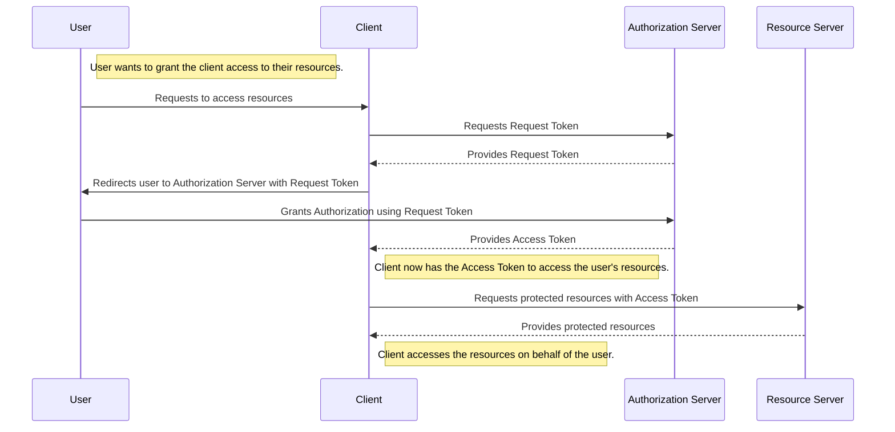
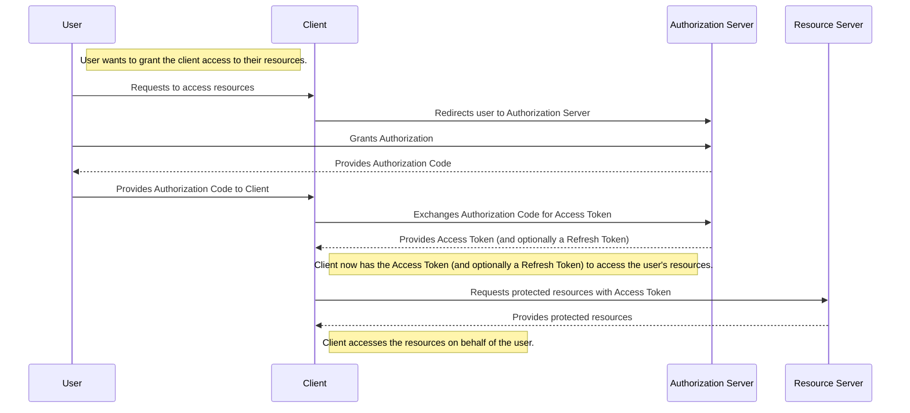
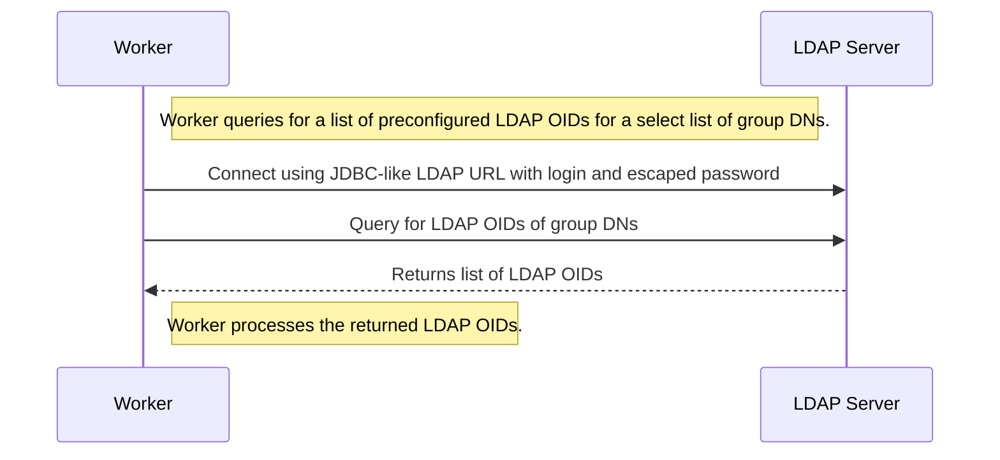

### oauh2

```mermaid
sequenceDiagram
    participant User
    participant Client
    participant AS as Authorization Server
    participant RS as Resource Server

    Note right of User: User wants to grant the client access to their resources.

    User ->> Client: Requests to access resources
    Client ->> AS: Requests Request Token
    AS -->> Client: Provides Request Token
    Client ->> User: Redirects user to Authorization Server with Request Token
    User ->> AS: Grants Authorization using Request Token
    AS -->> Client: Provides Access Token

    Note right of Client: Client now has the Access Token to access the user's resources.

    Client ->> RS: Requests protected resources with Access Token
    RS -->> Client: Provides protected resources

    Note right of Client: Client accesses the resources on behalf of the user.
```

### oauh2

```mermaid
sequenceDiagram
    participant User
    participant Client
    participant AS as Authorization Server
    participant RS as Resource Server

    Note right of User: User wants to grant the client access to their resources.

    User ->> Client: Requests to access resources
    Client ->> AS: Redirects user to Authorization Server
    User ->> AS: Grants Authorization
    AS -->> User: Provides Authorization Code
    User ->> Client: Provides Authorization Code to Client
    Client ->> AS: Exchanges Authorization Code for Access Token
    AS -->> Client: Provides Access Token (and optionally a Refresh Token)

    Note right of Client: Client now has the Access Token (and optionally a Refresh Token) to access the user's resources.

    Client ->> RS: Requests protected resources with Access Token
    RS -->> Client: Provides protected resources

    Note right of Client: Client accesses the resources on behalf of the user.
```

### ldap worker

```mermaid
sequenceDiagram
    participant Worker
    participant LDAP as LDAP Server

    Note right of Worker: Worker queries for a list of preconfigured LDAP OIDs for a select list of group DNs.

    Worker ->> LDAP: Connect using JDBC-like LDAP URL with login and escaped password
    Worker ->> LDAP: Query for LDAP OIDs of group DNs
    LDAP -->> Worker: Returns list of LDAP OIDs

    Note right of Worker: Worker processes the returned LDAP OIDs.

```

